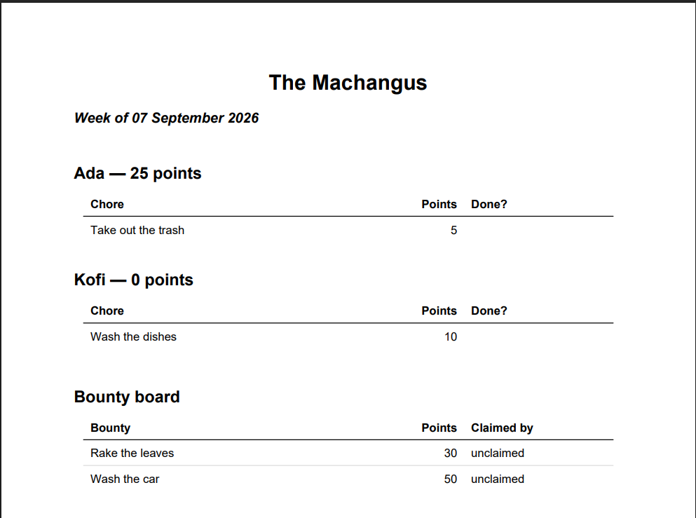
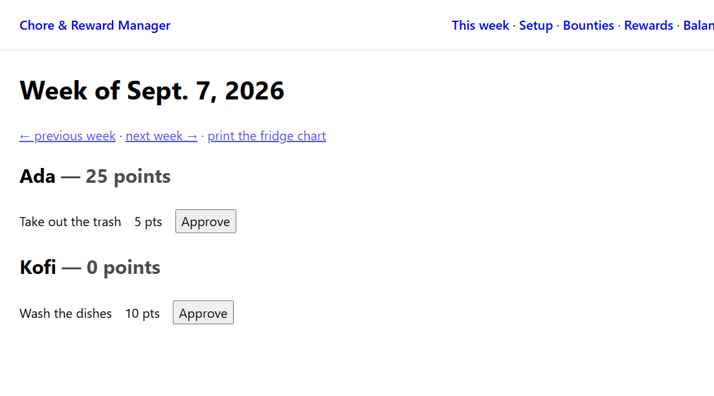
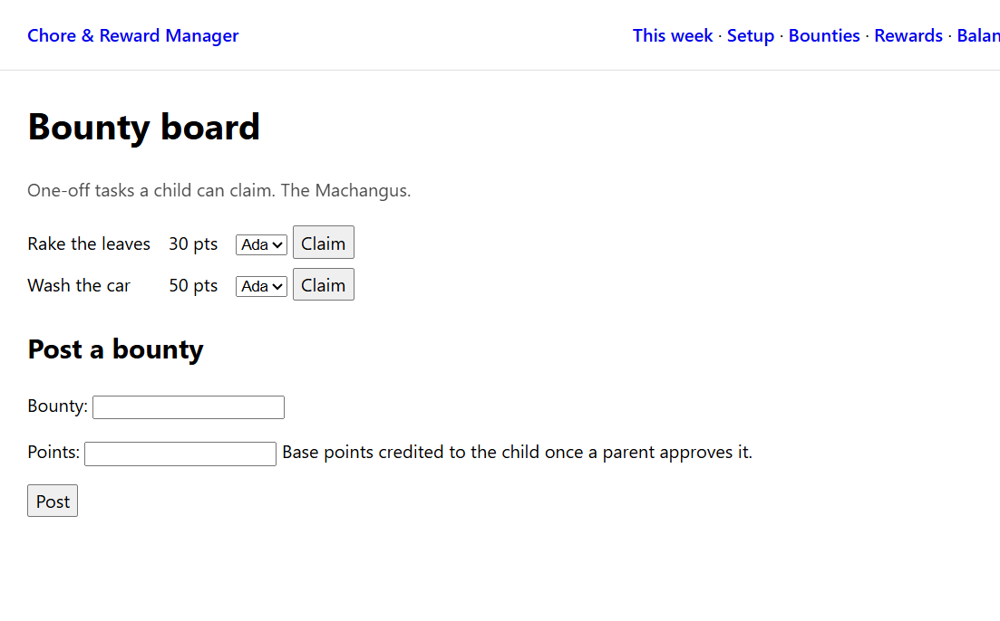
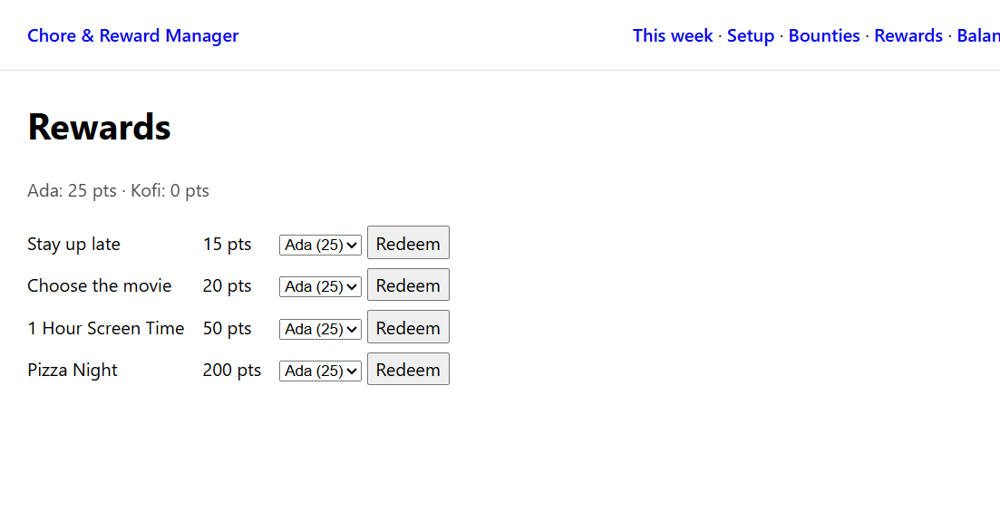
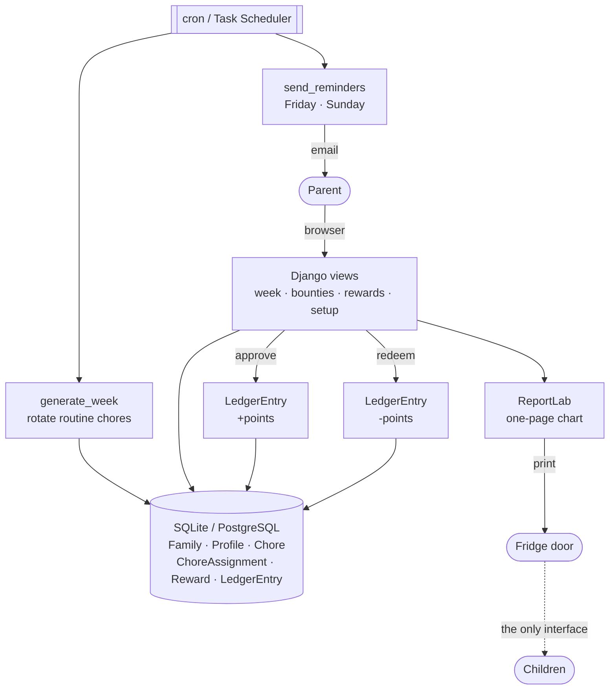

# Fridge Chart

A chore and reward tracker for families that keeps children off screens. Parents
run everything from a browser; the children's half of the system is a sheet of
paper on the fridge door.

Most chore apps put a phone in every child's hand. This one deliberately gives
them nothing to log into — the app's primary output is a printable weekly chart.



---

## The problem

A family wants chores shared fairly and effort rewarded. The usual approaches
each fail somewhere:

- **A paper chart alone** has no memory. Who did the dishes three weeks running?
  What has each child earned? Someone ends up doing arithmetic on the back of an
  envelope.
- **A chore app for the whole family** solves the bookkeeping by handing every
  child another screen and another set of notifications — the opposite of what
  many parents want.
- **Ad-hoc pocket money** is invisible. Children cannot see what they are working
  toward, and "you didn't do anything this week" turns into an argument.

The parent needs the bookkeeping. The child needs to see the week at a glance and
be motivated by it. Those are two different problems, and they do not need the
same interface.

## What it does

| | |
| --- | --- |
| **Rotates chores** | Recurring chores move to a different child each week, so nobody is stuck with the bins |
| **Pays only on approval** | A parent reviews the work; points are credited when they approve, never automatically |
| **Runs a rewards store** | Parents price their own rewards — "1 Hour Screen Time" at 50, "Pizza Night" at 200 — and children spend points on them |
| **Posts bounties** | One-off, higher-value jobs a child volunteers for, rather than being assigned |
| **Keeps a ledger** | Every point earned and spent, auditable per child |
| **Starts each week clean** | Unfinished chores do not roll over and there are no penalties; the week resets every Monday |
| **Prints the chart** | The week as a one-page PDF: rotation, balances and open bounties |
| **Nudges twice a week** | Friday to approve, Sunday to print. Nothing on the other five days |

## Demo

There is no public deployment — see [Limitations](#limitations). These are the
real screens, and the chart above is a real generated file
([`_docs/examples/week-chart.pdf`](_docs/examples/week-chart.pdf)).

**The week, grouped by child.** Each pending chore has an Approve button;
approving credits the points.



**The bounty board.** A parent posts a one-off job; the child who volunteers is
assigned it, and it still goes through the same approval before paying.



**The rewards store.** Redeeming deducts the cost. A child who cannot afford
something is refused, and balances never go negative.



## Quickstart

Requires **Python 3.14** and [**uv**](https://docs.astral.sh/uv/). No database
server is needed — development runs on SQLite.

```bash
git clone https://github.com/brave-machangu/ai-dev-tools-homework.git
cd ai-dev-tools-homework
uv sync                                  # install dependencies
uv run python manage.py migrate          # create the database
uv run python manage.py createsuperuser  # your first parent account
uv run python manage.py runserver        # http://127.0.0.1:8000/
```

Sign in and the app walks you through naming the family, adding the children,
and defining the chores and rewards. Then generate the coming week:

```bash
uv run python manage.py generate_week
```

Open **This week**, approve something, and click **print the fridge chart**.

### Everyday commands

```bash
uv run python manage.py test            # the test suite (26 tests)
uv run python manage.py generate_week   # rotate next week's routine chores
uv run python manage.py send_reminders  # Friday/Sunday nudge; silent otherwise
uv run python manage.py check --deploy  # production readiness checks
```

`generate_week` takes `--week YYYY-MM-DD` to target another week and `--family`
when more than one family exists. `send_reminders` takes `--date` to simulate a
day, which is how you test it without waiting for Friday.

## Configuration

Everything runs with no configuration in development. For anything else, copy
[`.env.example`](.env.example) and set what you need:

| Variable | Required | What it controls |
| --- | --- | --- |
| `DJANGO_SECRET_KEY` | in production | Signing key. The fallback in `settings.py` is public — generate a fresh one |
| `DJANGO_DEBUG` | in production | `false` turns on HTTPS redirects, secure cookies and HSTS |
| `DJANGO_ALLOWED_HOSTS` | in production | Comma-separated hostnames |
| `POSTGRES_DB` and friends | optional | Switches from SQLite to PostgreSQL |
| `EMAIL_HOST` and friends | optional | Sends reminders over SMTP instead of printing them |

Full details, including how to schedule the reminders with cron or Task
Scheduler, are in [`_docs/deployment.md`](_docs/deployment.md).

## How it works



Children appear in the database as profiles with no user account — a database
constraint enforces it — so the dotted line is the whole of their interaction
with the system.

The rules that matter live in the database rather than in view code:

| Constraint | What it prevents |
| --- | --- |
| `children_have_no_user_account` | A child ever being given a login |
| `one_holder_per_chore_per_week` | The same chore being assigned twice in a week |
| `LedgerEntry.assignment` is one-to-one | An approval crediting points twice |
| `ledger_entry_moves_points` | Zero-point noise in the audit trail |

## Does it work?

**Tests.** 26, covering the rules that are expensive to get wrong:

```
$ uv run python manage.py test
Ran 26 tests in 19.348s
OK
```

| Area | What is pinned down |
| --- | --- |
| Approval | Credits once however often it is posted; nothing before approval |
| Redemption | Exact cost deducted; unaffordable refused; an exact balance lands on zero |
| Rotation | A different child each week; bounties never auto-assigned; re-runs create nothing; last week untouched |
| Constraints | Each of the four above, proven by the database rejecting bad data |
| Access | Every page needs a login; another family's child is a 404 |
| Reminders | Two days send, five days stay silent |

The suite was checked against deliberately broken code: with the double-credit
guard and the affordability check removed, five tests fail. A suite that passes
either way is worse than none.

**No monitoring.** Nothing tracks what happens in a running deployment — see
[Limitations](#limitations).

## Project structure

```
config/                     Django project: settings, urls, wsgi/asgi
chores/                     the app
  models.py                 Family, Profile, Chore, ChoreAssignment, Reward, LedgerEntry
  views.py                  week dashboard, bounties, rewards, balances, setup, PDF
  forms.py                  posting bounties and first-run setup
  pdf.py                    the printable chart, built with ReportLab
  tests.py                  the suite
  management/commands/
    generate_week.py        rotate the coming week's routine chores
    send_reminders.py       the Friday and Sunday nudges
_docs/plan.md               the original product spec
_docs/deployment.md         environment variables, PostgreSQL, scheduling
_docs/team/                 how this project is run: scope, process, roles
backlog.md                  the numbered tasks, mirrored as GitHub issues
```

## Decisions and trade-offs

**ReportLab rather than WeasyPrint.** WeasyPrint would have let the chart reuse
the Django templates, but on Windows it needs GTK native libraries installed
separately, which is a common source of failed setups. ReportLab installs from
pure-Python wheels everywhere. The cost is that the chart is laid out in code
instead of HTML.

**Invariants in the database, not just in views.** Every rule above could have
been a check inside a view. Putting them in constraints means a future view, a
management command, or a shell session cannot quietly break them — and the
double-submit race on approval is impossible rather than unlikely. The cost is a
migration whenever a rule changes.

**A week is identified by its Monday.** There is no scheduled job that "resets"
anything; a week is simply a `week_start` date, and last week's unfinished work
stays in last week. This makes `generate_week` idempotent and back-fillable, at
the cost of the rotation being derived arithmetically rather than stored.

**Children have no accounts at all.** The alternative — an account per child with
an unusable password — is closer to stock Django, but it creates exactly the
thing the product is designed to avoid. `Profile.user` is nullable instead.

**SQLite by default.** The spec asks for PostgreSQL in production, and the
settings switch on `POSTGRES_DB`, but a family app that runs from a single file
is far easier to try. See the caveat in Limitations.

## How the work was tracked

The spec is [`_docs/plan.md`](_docs/plan.md). It was broken into eleven numbered
tasks in [`backlog.md`](backlog.md), each mirrored as a GitHub issue with a
runnable acceptance check, and each closed by a single commit. Seven follow-up
issues came from work those tasks left behind.

[`_docs/team/`](_docs/team) documents the process itself — scope
([`pm.md`](_docs/team/pm.md)), the route from spec to commit
([`process.md`](_docs/team/process.md)), what counts as evidence
([`qa-engineer.md`](_docs/team/qa-engineer.md)), and the issue shape
([`task-template.md`](_docs/team/task-template.md)).

## Limitations

- **No public deployment.** The app runs locally or on your own host; there is
  nothing to click on the internet.
- **PostgreSQL is configured but unproven.** `POSTGRES_DB` switches the engine
  and `uv sync --extra postgres` installs the driver, but `migrate` has never run
  against a real PostgreSQL server, so the constraints are verified on SQLite
  only ([#14](../../issues/14)).
- **No monitoring.** No metrics, no error tracking, no dashboard. You would find
  out something broke when a parent told you.
- **No CI.** The tests run locally; nothing runs them on push.
- **The committed `SECRET_KEY` is public.** It is a development fallback and is
  in this repository's history. Any real deployment needs a fresh one.
- **One family per parent account.** The models support many families, but a
  parent is resolved through a single profile, and `generate_week` needs
  `--family` once more than one exists.
- **No self-registration.** The first parent account comes from
  `createsuperuser`; there is no sign-up page and no way to invite a second
  parent from the UI.
- **Children have no interface, by design.** This is a product decision, not a
  gap. It is listed here so nobody mistakes it for one.

## Future work

In rough priority order:

1. **Prove PostgreSQL** by running the migrations and the suite against a real
   server ([#14](../../issues/14)) — the check constraints are the part worth
   verifying, not the connection.
2. **Add CI** so the suite runs on every push, since the tests only help if
   something runs them.
3. **Invite a second parent** from the UI, because most households have two, and
   `createsuperuser` is not an answer for the other one.
4. **Basic monitoring** — even an error log with alerting would beat finding out
   from a family member.
5. **Let a bounty repeat.** The board retires one when it is approved, but there
   is no way to post "wash the car" again next month without renaming it.
